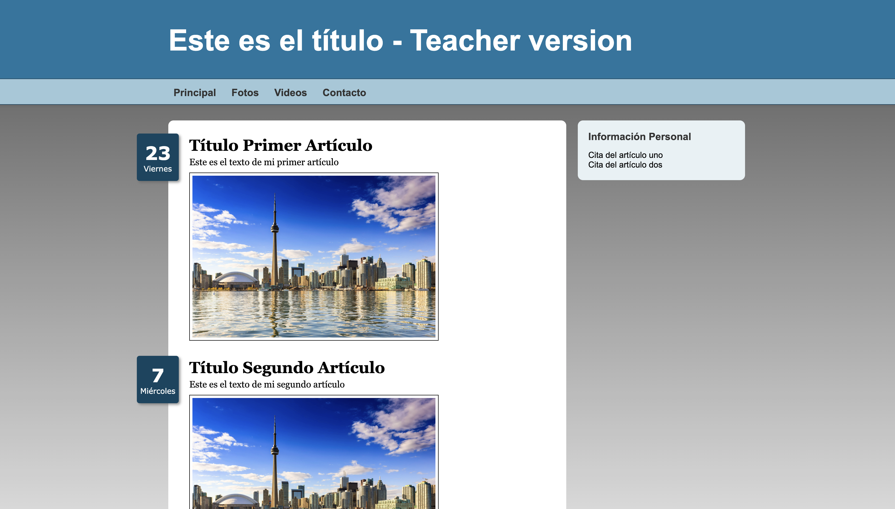
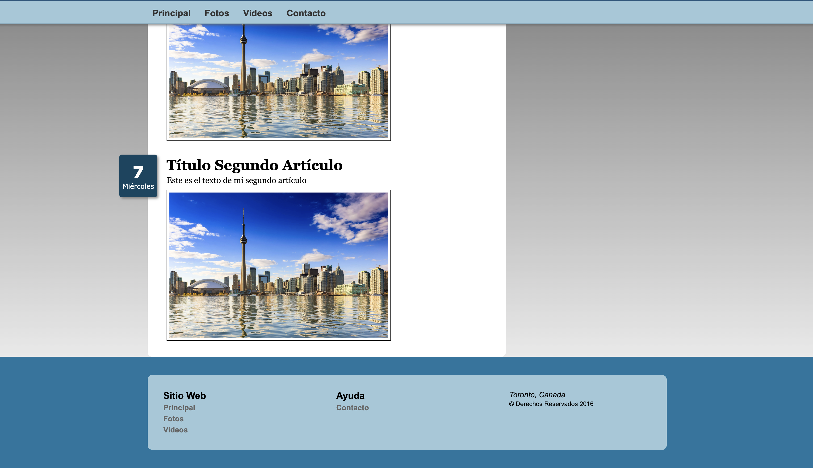

## Ejemplo de maquetación 1 usando flex-box

En este ejemplo se usa el modelo de cajas haciendo uso de `flex-box` para realizar la maquetación. 

> Está basado en el ejemplo que aparece en la página 191 de libro`El gran libro de HTML, CSS y JS`, pero se ha adaptado para usar variables de CSS y realizar maquetación basada en tamaños relativos en lugar de absolutos.

**Importante**: Hay que maquetar haciendo uso de las variables que vienen ya definidas en el CSS.

- Este es el resultado de la maquetación. Parte superior de la página

- Aí luciría el footer. Hay que darse cuenta que la barra de navegación se queda fija en la parte superior cuando hacemos scroll.

